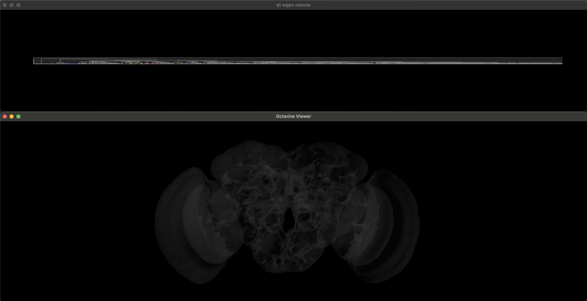
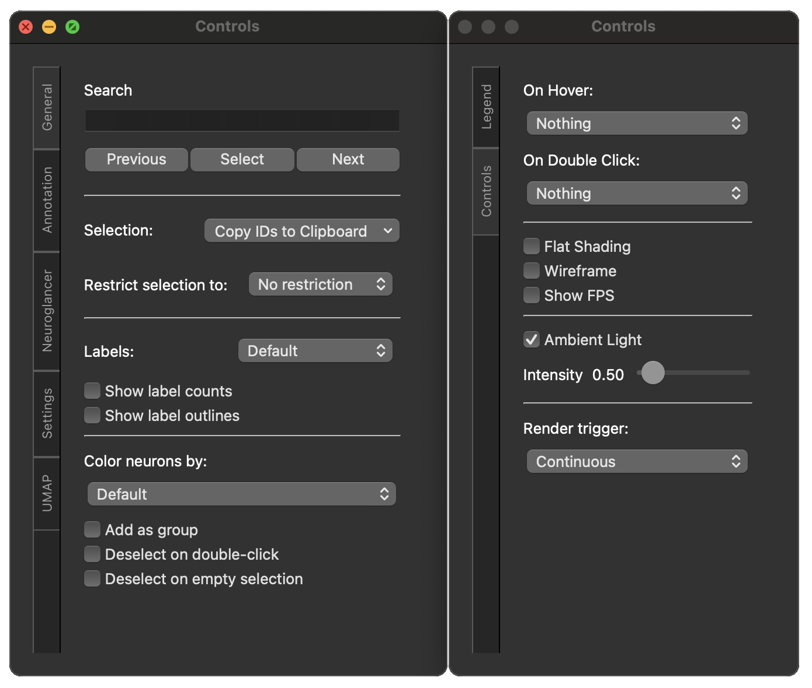

# BigClust

`bigclust` is a set of tools for interactively exploring clusterings via dendrograms with several 100k leafs.
For that we are making use of the `pygfx` WGPU-based rendering engine.

## Installation

For now the recommended way of installing this package is this:

1. Clone the repository:
   ```bash
   git clone https://github.com/flyconnectome/bigclust.git
   ```
2. Install in "editable" mode:
   ```bash
   cd bigclust
   pip install -e .
   ```

With this setup, you can just `git pull` to update the package.

## Usage

I imagine the typical usage will be to run a big one-off clustering on a remote cluster node and then
load that clustering into `bigclust` on a local machine. Therefore, `bigclust` is designed to work with data artefacts
rather than running the clustering itself.

Minimally, you will need:
1. A [linkage](https://docs.scipy.org/doc/scipy/reference/generated/scipy.cluster.hierarchy.linkage.html) describing the dendrogram.
2. A pandas DataFrame with meta data for the original observations.

We are using `bigclust` for clustering large number of neurons. Therefore `bigclust` also provides a Neuroglancer-like widget to explore
morphology and a connectivity widget.

Let's illustrate the usage with a simple toy example using the [`cocoa`](https://github.com/flyconnectome/cocoa) package for comparative connectomic analyses:

### Step 1: Run a co-clustering

```python
import cocoa as cc
import numpy as np

# Co-cluster two cell types in FlyWire left vs right
cl = cc.generate_clustering(fw=['DA1_lPN', 'DA2_lPN']).compile()
```

### Step 2: Get the data artifacts

```python
# Get the linkage (this is a simple scipy linkage)
Z = cl.get_linkage(method='ward')
np.save("linkage.npy", Z, allow_pickle=False)

# Prepare a table with details we can use as e.g. labels in the dendrogram
t = cl.to_table(cl.extract_homogeneous_clusters(max_dist=2, min_dist=.1, linkage=Z), linkage=Z)

# Save and make sure the order is the same as in our distance matrix
t.set_index("id").reindex(index).reset_index(drop=False).to_feather("cosine_table.feather")
```

_*feel free to use more sensible file names_

### Step 3: Write a start-up script

Open a new python script - name it e.g. `run_bigclust.py`:

```python
import pandas as pd
import numpy as np
import trimesh as tm
import bigclust as bc

from wgpu.gui.auto import run
from bigclust._neuroglancer import NglViewer


if __name__ == "__main__":
    # Parse arguments
    update_labels = "--update-labels" in sys.argv

    print("Loading data...", flush=True, end="")

    # Load the linkage matrix
    Z = np.load("linkage.npy")

    # This is the table with the neuron information, including the clusters
    table = pd.read_feather("cosine_table.feather")

    # Add source information -> we need this to load the neuron meshes in the Neuroglancer viewer
    table["source"] = "precomputed://gs://flywire_v141_m783"

    # Here we define the default colors for the neurons
    table["color"] = table.dataset.map(
        {"FwR": "cyan", "FWL": "lightskyblue"}
    )

    print(" Done.", flush=True)

    print("Making dendrogram...", flush=True, end="")
    # Now we will instantiate the dendrogram
    fig = bc.Dendrogram(
        Z,
        table=table,
        labels='label',
        leaf_types='dataset',
        clusters='cluster',
        ids='id',
    )
    fig.show()

    # Some tweaks:
    fig.size = (fig.canvas.screen().size().width(), 300)  # make the dendrogram fill the width of the screen
    fig.canvas.move(0, 0)  # nove it into the top left corner
    fig.font_size = 6  # slight larger font size
    fig.label_vis_limit = 300  # show more labels before hiding all
    fig.leaf_size = 3  # slightly larger leaf size
    fig.set_yscale(100)  # make the dendrogram a bit taller

    print(".", flush=True, end="")

    # Load the neuropil mesh for FlyWire from Github
    # We will add this to the viewer to make navigation easier
    # You could download and store it locally if you want to
    neuropil_mesh = tm.load_remote(
        "https://github.com/navis-org/navis-flybrains/raw/main/flybrains/meshes/FLYWIRE.ply"
    )

    # Instantiate the viewer
    ngl = NglViewer(table, neuropil_mesh=neuropil_mesh)
    ngl.viewer.size = (ngl.viewer.canvas.screen().size().width(), 500)
    ngl.viewer.canvas.move(0, 400)

    # Tell the dendrogram to sync with the viewer
    fig.sync_viewer(ngl)

    print(" Done!", flush=True)

    # Run the app
    # Note: this is only necessary if we're running bigclust from a script
    run()
```

*Make sure to adjust the filepaths if necessary.*

### Step 4: Fire up `bigclust`

Make sure you have all the data artifacts (`linkage.npy` and `cosine_table.feather`) in the same folder as
the `run_bigclust.py` script. Then:

```bash
python run_bigclust.py
```


### Step 5: Using the app

You should now be seeing something like this:



The top window contains the dendrogram, the bottom is your 3D viewer.

Dendrogram controls:
- scroll up/down to zoom in/out
- mouse drag to move around
- shift+drag to select neurons (they should appear in the viewer)
- `escape` or double-click to deselect
- hover over a dendrogram leaf to show extra information (see `hover_info` parameter)

3D viewer controls:
- scroll up/down to zoom in/out
- mouse drag to rotate
- two-finger (or middle mouse button) mouse drag to pan
- `1`/`2`/`3` to center the view to frontal/dorsal/lateral

In addition to the above, you can press `C` while either the viewer or the dendrogram window
is active to bring up a GUI control panel.

<center></center>

